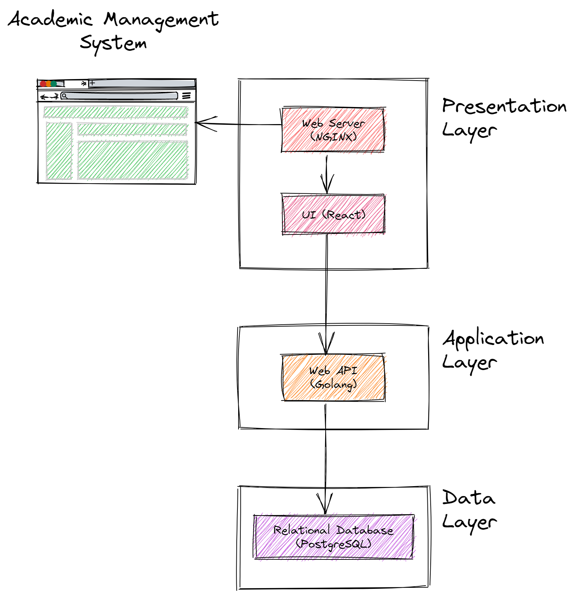

# Academic Management System

## Introduction

This project is a simple academic management system to simulate multi tier architecture.

## Demo

Since the project is deployed on Google Cloud Run, the first request may take a few seconds to respond due to cold start.

Client UI: https://academic-management.vercel.app/  
API Playground: https://ams-server-gztuymsfwq-as.a.run.app

## Technologies

- React (Vite)
- GraphQL (Apollo, gqlgen)
- Golang (Chi)
- PostgreSQL
- Docker

## Architecture

## Setup

### Backend & Database

1. Clone the repository
2. copy `.env.example` to `.env` and fill in the environment variables
3. Run `docker-compose up` in the root directory
4. Run `make migrate-up` to migrate the database
5. Run `make seed` to seed the database
6. Open `http://localhost:8080` in your browser to access the graphql playground

### Frontend

1. Run `cd client`
2. Run `pnpm install`
3. Run `pnpm dev`
4. Open `http://localhost:3000` in your browser

## Configuring Ports

- The frontend is configured to run on port 3000, you can change this in `client/vite.config.ts`
- The backend is configured to run on port 8080, you can change this in `env` file with name `BACKEND_PORT`

## Generating GraphQL Types

1. You can customize the graphql types by editing `server/graph/schema.graphql`
2. After editing the schema, run `go run github.com/99designs/gqlgen` to generate the types
3. The generated types are in `server/graph/`
4. To generate Client side types, run `npx graphql-codegen` in the `client` directory
5. The generated types are in `client/src/gql`

## Generating Migrations

1. Run `make create-migration migration_name` to create a new migration
2. The migration file will be in `server/database/migrations`
3. Fill in the migration file with the desired changes
4. Run `make migrate-up` to apply the migration
